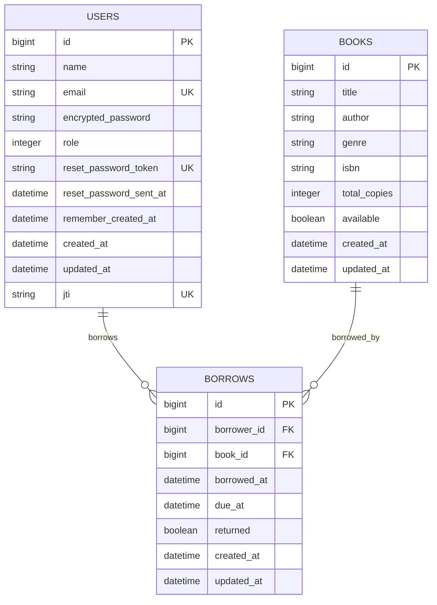

# Library Backend API

A Rails API-only backend application for a Library application, containerized with Docker.

### Development Users

* Librarian User:
 > User: librarian@email.com<br>
 > Password: librarian123
* First Member User:
 > User: member@email.com<br>
 > Password: member123
* Second Member User:
 > User: member2@email.com<br>
 > Password: member123

### Main Tecnologies

* Ruby version 3.2.0
* Rails version 8.0.3
* Postgresql version 15.2

### Running Library Backend in development

* Clone repository;
* Ask the "master.key" for repository owner;
* Put "master.key" in config folder;
* In root path of project build the containers:
```sh
docker compose build
```
* To create, migrate and seed database:
```sh
docker compose run --rm web rails db:setup
```
* To access Rails console:
```sh
docker compose run --rm web rails c
```
* To run the application:
```sh
docker compose up
```
* Application runs in http://localhost:3000

### Tests

* Using [rspec](https://rspec.info) for tests.
* To run all tests:
```sh
docker compose run --rm web rspec
```

## Database ER Diagram



